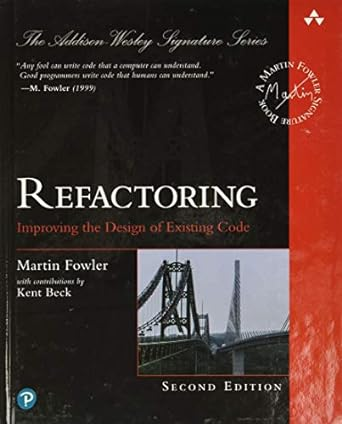

# Clean Code e Refactoring Ideias de Robert Martin

<br>

<center>
<p>
  
  
</p>
</center>

<br>

## Visão Geral
<br>

Na visão de Robert Martin, código limpo não é apenas um código que funciona; é também um código que é fácil de entender e modificar. Ele destaca a importância de escrever código de maneira clara, expressiva e eficiente, com o objetivo de torná-lo compreensível não apenas para o autor original, mas também para outros desenvolvedores que possam trabalhar no mesmo código no futuro.

<br>

## Princípios-Chave do Clean Code

<br>

- **Nomes Significativos:** Escolha nomes que revelem a intenção por trás das variáveis, funções ou classes. Nomes bem escolhidos tornam o código mais legível.

- **Funções Pequenas:** Mantenha as funções pequenas e focadas em uma única tarefa. Funções pequenas são mais fáceis de entender e testar.

- **Comentários:** Evite comentários óbvios, mas forneça comentários explicativos quando necessário para esclarecer complexidades.

- **Evitar Duplicação:** Evite repetição de código. Utilize abstrações e funções para evitar duplicação e promover a reutilização.

- **Testes:** Escreva testes para garantir que o código funciona conforme esperado. O código limpo é geralmente altamente testável.

- **Menos é Mais:** Evite excesso de complexidade. Prefira soluções simples e diretas.

- **Organização e Estrutura:** Organize o código de maneira lógica e estruturada. Mantenha uma estrutura consistente para facilitar a navegação.

- **Dependências:** Gerencie as dependências de forma eficaz. Evite acoplamento desnecessário entre diferentes partes do código.

<br>

## SOLID Principles

- **Single Responsibility Principle (SRP):** Uma classe deve ter apenas um motivo para mudar.

```js
class Calculadora {
    soma(a, b) {
        return a + b;
    }

    subtracao(a, b) {
        return a - b;
    }
}

/**
 * 
 * Neste exemplo, a classe Calculadora tem a responsabilidade de realizar operações 
 * matemáticas simples, como soma e subtração. 
 * Se a lógica de cálculo mudar, apenas a Calculadora será afetada.
 * 
 */
```


- **Open/Closed Principle (OCP):** Entidades de software (classes, módulos, funções, etc.) devem ser abertas para extensão, mas fechadas para modificação.

```js
class Forma {
    area() {
        throw new Error('Método area() deve ser implementado nas subclasses');
    }
}

class Quadrado extends Forma {
    constructor(lado) {
        super();
        this.lado = lado;
    }

    area() {
        return this.lado ** 2;
    }
}

class Circulo extends Forma {
    constructor(raio) {
        super();
        this.raio = raio;
    }

    area() {
        return 3.14 * this.raio ** 2;
    }
}

/**
 * 
 * Novas formas podem ser adicionadas sem modificar o código existente (fechado para modificação, aberto para extensão).
 * 
 */
```

- **Liskov Substitution Principle (LSP):** Subtipos devem ser substituíveis por seus tipos base sem afetar a funcionalidade.

```js
class Ave {
    voar() {
        console.log('Voando...');
    }
}

class Pinguim extends Ave {
    voar() {
        throw new Error('Pinguins não podem voar.');
    }
}

/**
 * 
 * Neste exemplo, Pinguim é um subtipo de Ave, mas substituir o método voar para refletir o comportamento específico do pinguim
 * não quebra a funcionalidade geral do programa.
 * 
 */
```

- **Interface Segregation Principle (ISP):** Uma classe não deve ser forçada a implementar interfaces que ela não usa.

```ts
// Interface para dispositivos que podem imprimir
class Imprimivel {
    imprimir() {
        throw new Error('Método imprimir() deve ser implementado nas subclasses');
    }
}

// Classe para uma impressora
class Impressora extends Imprimivel {
    imprimir() {
        console.log('Imprimindo documento...');
    }
}

// Classe para um scanner
class Scanner {
    digitalizar() {
        console.log('Digitalizando documento...');
    }
}


interface UpdateAndDelete {
    update();
    delete();
}

interface CreateAndRead {
    create();
    read();
}

class todo implements CreateAndRead, UpdateAndDelete {}

class people implements CreateAndRead {}

/**
 * 
 * Neste exemplo, Scanner não precisa implementar a interface Imprimivel, pois não tem a capacidade de imprimir. Cada classe 
 * implementa apenas as interfaces relevantes para sua funcionalidade.
 * 
 */
```

- **Dependency Inversion Principle (DIP):** Módulos de alto nível não devem depender de módulos de baixo nível; ambos devem depender de abstrações.

```ts
// Módulo de alto nível dependendo de uma abstração
class GerenciadorDePagamento {
    constructor(processadorDePagamento: ProcessadorPagamento) {
        this.processadorDePagamento = processadorDePagamento;
    }

    processarPagamento() {
        this.processadorDePagamento.processar();
    }
}

interface ProcessadoPagamento {
    processa(): void;
}

// Módulo de baixo nível implementando a abstração
class ProcessadorDePagamento1 implements ProcessadorPagamento {
    processar() {
        console.log('Processando pagamento...');
    }
}

class ProcessadorDePagamento2 implements ProcessadorPagamento {
    processar() {
        console.log('Processando pagamento...');
    }
}


/**
 * 
 * Neste exemplo, GerenciadorDePagamento depende da abstração ProcessadorDePagamento, não diretamente da implementação específica 
 * Isso permite fácil substituição e extensão do módulo de baixo nível sem afetar o módulo de alto nível.
 * 
 */
```

<br>

## Code Smells

**são indicações de possíveis problemas no código-fonte que podem indicar a necessidade de refatoração. Eles não são erros diretos, mas pistas que sugerem que há algo no código que pode não estar ideal, comprometendo a qualidade do software. A detecção e correção de "code smells" são parte integrante da prática de manter um código limpo, legível e fácil de manter.**

<br>

> Nomes ruins

- **É um nome de variável, método, função, classe, arquivo, que não é suficientemente claro**

- *técnica de refactoring:*
    - renomear variável
    - renomear método
    - renomear função
    - renomear classe
    - renomear arquivo

> Linhas em branco

- *técnica de refactoring:*
    - apagar linhas em branco dentro de métodos e funções

> Comentários

- *técnica de refactoring:*
    - introduzir variável explicativa
    - extrair métodos e funções

> Código morto

- *técnica de refactoring:*
    - apagar código

> Condições confusas e aninhadas

- *técnica de refactoring:*
    - extrair condições
    - introduzir claúsulas de guarda (inverter as condições e interromper o fluxo de execução para eliminar o else)
    - consolidar condições
    - introduzir ternário

> Tratamento inadequado de erros ou exceções

- *técnicas de refactoring:*
    - tratar adequadamente os erros ou exceções

> Números mágicos

- *técnicas de refactoring:*
    - extrair constantes
    - extrair variáveis explicativas

> Método longo

> Classe longa